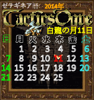

#タクティクスオウガ (Tactics Ogre) Calandar ver 0.1
##皇家騎士團2 (賽提基內亞歷) html5 月曆


心血來潮的產物，以**SFC**時代的TO版本為主將西曆轉換為遊戲內**賽提基內亞歷**

轉換規則如下
>  1.	神龍の月＝ 1月 1日～ 1月24日——乾季24  
   2.	地龍の月＝ 1月25日～ 2月18日——乾季25  
   3.	水龍の月＝ 2月19日～ 3月13日——雨季23 or 24(如閏年)  
   4.	影龍の月＝ 3月14日～ 4月 6日——雨季24  
   5.	白龍の月＝ 4月 7日～ 5月 1日——乾季25  
   6.	炎龍の月＝ 5月 2日～ 5月25日——乾季24  
   7.	風龍の月＝ 5月26日～ 6月18日——乾季24  
   8.	金龍の月＝ 6月19日～ 7月13日——乾季25  
   9.	雷龍の月＝ 7月14日～ 8月 6日——雨季24  
   10.	闇龍の月＝ 8月 7日～ 8月30日——雨季24  
  11.	海龍の月＝ 8月31日～ 9月24日——雨季25  
  12.	黑龍の月＝ 9月25日～10月18日——雨季24  
  13.	雙龍の月＝10月19日～11月11日——雨季24  
  14.	火龍の月＝11月12日～12月 6日——乾季25  
  15.	光龍の月＝12月 7日～12月31日——乾季25  

###how to use
請確保瀏覽器支援html5 canvas
再`<head></head>`間  
插入`<script src="./to_time.js" type='text/javascript'></script>`

在想顯示的位置插入  
```
<div id='to_calendar' style="width: 158px; height: 168px;"></div>
<script type='text/javascript'>
    var to_calendar=new TacticsOrge_calandar();
    to_calendar.creat_calandar();
</script>
```
如果不想用預設大小請更改`style` width & height值  

最後會產生  
```
<div id="to_calendar" style="width: 158px; height: 168px;">
	<canvas width="158" height="168"></canvas>
</div>
```